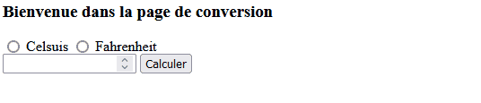

# Django Demonstration - *Temperature Converter* <!-- omit in toc -->

***A series of tutorials to understand Django by implementing a complete Temperature Converter Application.***

---

## Table of Contents <!-- omit in toc -->
- [Coding Environment](#coding-environment)
- [Coding Steps](#coding-steps)
  - [Basic App](#basic-app)
  - [Use of Templates](#use-of-templates)
  - [Data Management](#data-management)
  - [REST API and Authentication](#rest-api-and-authentication)
- [License](#license)

---

## Coding Environment

This projet is built using these technologies:

- Programming Language: **Python**
- Web Browser: **Mozilla Firefox**
- Code Editor: **Microsoft Visual Studio Code** *(with extensions)*
- Virtual Environment: **venv**
    1. Create virtual environment with: `python -m venv django_venv`
    2. Then, activate it with: `.\django_venv\Scripts\activate`

## Coding Steps

### Basic App

#### **1. Requirements** <!-- omit in toc --> 

For the first step, we install the main package with: `python -m pip install django`

Then, create a new **app** with the title: `first_django_app`

#### **2. Goals** <!-- omit in toc --> 

In this steps, we have to achieve the following goals: 

1. Create two routes : *converter* and *results*
2. Make the conversion from **celsius** to **fahrenheit** and vice versa
3. Use only `urls.py` (routes) and `views.py` (functions)

#### **3. Results** <!-- omit in toc -->  

### Use of Templates

### Data Management

### REST API and Authentication

## License

